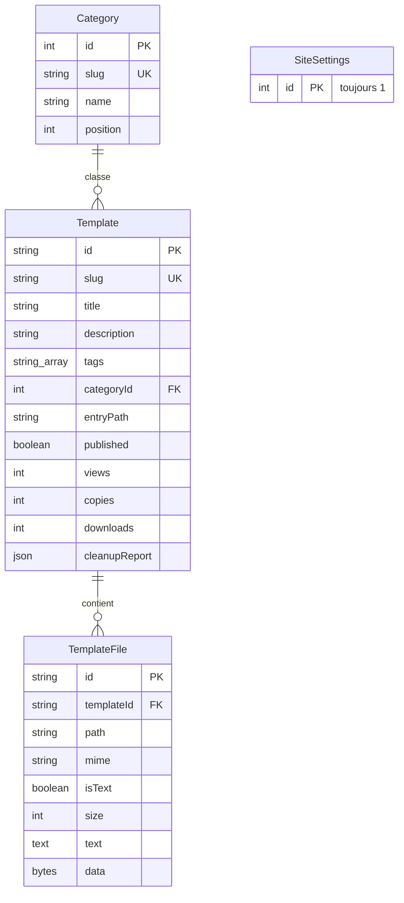

# Boutique Templates

**Une galerie de templates web où l'on voit d'abord, on copie ensuite.**
Les visiteurs n'ont pas de compte à créer : ils parcourent la galerie, regardent chaque template tourner en direct, lisent son code, le copient ou téléchargent le projet complet en ZIP. Un espace d'administration permet d'ajouter des templates (archive ZIP, dossier, fichiers ou code collé) et d'y apposer automatiquement sa signature.

JavaScript natif de bout en bout : pas de framework, pas de bundler, pas de bibliothèque ZIP. La seule dépendance est Prisma, pour parler à PostgreSQL. Le projet se déploie tel quel sur Vercel.

---

## Sommaire

1. [Fonctionnalités](#fonctionnalités)
2. [Stack technique](#stack-technique)
3. [Démarrage rapide](#démarrage-rapide)
4. [Variables d'environnement et scripts](#variables-denvironnement-et-scripts)
5. [Déploiement sur Vercel](#déploiement-sur-vercel)
6. [Structure du projet](#structure-du-projet)
7. [Architecture de la plateforme](#architecture-de-la-plateforme)
8. [API](#api)
9. [Base de données](#base-de-données)
10. [Signature et nettoyage des mentions d'auteur](#signature-et-nettoyage-des-mentions-dauteur)
11. [Import de templates](#import-de-templates)
12. [Seed](#seed)
13. [Limites](#limites)
14. [Sécurité](#sécurité)
15. [Tests et mode démo](#tests-et-mode-démo)
16. [Dépannage](#dépannage)

---

## Fonctionnalités

### Pour les visiteurs (sans compte)

- **Galerie** : grille de cartes dont les vignettes sont le *vrai* site, réduit et chargé à la demande (aucune capture d'écran à produire ni à maintenir).
- **Recherche** instantanée sur le titre, la description, les mots-clés et le nom de catégorie. Raccourci clavier `/` pour y accéder.
- **Filtres** par catégorie (avec compteurs) et **tri** : récents, plus vus, plus téléchargés. Pagination « Afficher plus ».
- **Aperçu en direct** dans un cadre de navigateur, avec bascule **Ordinateur / Tablette / Mobile**. Le template est interactif : on peut cliquer et naviguer entre ses pages.
- **Visualiseur de code** : arborescence des fichiers, coloration syntaxique (HTML, CSS, JS), numérotation des lignes, aperçu des images.
- **Copie** du fichier courant, ou de **tout le code** en un clic.
- **Téléchargement du projet complet en ZIP**, assemblé dans le navigateur.
- **Templates sans aperçu** (applications Python, PHP…) : affichés en « code seul », code et ZIP complets.
- **Suggestions** : autres templates de la même catégorie.
- Thème **clair / sombre** (suit le système, mémorisé après un choix), responsive, navigation au clavier, `prefers-reduced-motion` respecté.

### Pour l'administrateur (`/admin`)

- **Ajout** par glisser-déposer d'une archive ZIP, ou via un dossier, des fichiers, ou du **code collé** (HTML / CSS / JS : les liens vers `style.css` et `script.js` sont ajoutés automatiquement). 
- **Remplacement** des fichiers d'un template existant, modification des informations, masquage / publication, suppression.
- **Signature** appliquée automatiquement à tous les templates : initiales, nom affiché, badge (position, couleurs), commentaire `© initiales` en tête de fichier.
- **Nettoyage des mentions d'auteur** : liste de termes à retirer, appliquée à l'import et ré-applicable à tout le catalogue.
- **Catégories** : création et suppression.
- **Indicateurs** : nombre de templates, de vues, de codes copiés et de ZIP téléchargés, avec le détail par template.
- **Rapport d'import** par template : mentions retirées, licences conservées, fichiers ignorés.

---

## Stack technique

| Couche | Choix |
| --- | --- |
| Front | HTML, CSS et **JavaScript natif** (modules ES), sans build |
| Back | Fonctions serverless **Node.js ≥ 20** (`api/`), JavaScript ES modules |
| Base de données | **PostgreSQL** via **Prisma** |
| Hébergement | **Vercel** (fichiers statiques + fonctions) |
| ZIP | Lecture et création **natives** (`DecompressionStream` / `CompressionStream`) |
| Authentification | Mot de passe unique en variable d'environnement, cookie signé HMAC (`node:crypto`) |
| Typographie | Bricolage Grotesque, Instrument Sans, JetBrains Mono (Google Fonts, avec repli système) |

Navigateurs : versions récentes de Chrome, Edge, Firefox (≥ 113) et Safari (≥ 16.4), nécessaires pour `CompressionStream` / `DecompressionStream`.

---

## Démarrage rapide

### Essayer sans rien installer côté base

```bash
npm run demo
```

Ouvre <http://localhost:3000>. L'admin est sur `/admin` avec le mot de passe `demo`.
Le mode démo exécute les **vraies** fonctions de `api/` sur une base **en mémoire** alimentée par le seed. Rien n'est conservé à l'arrêt, aucun compte n'est nécessaire.

### Installation complète

```bash
# 1. Base PostgreSQL (Neon, Supabase, Vercel Postgres, local…)
cp .env.example .env        # renseigne DATABASE_URL, ADMIN_PASSWORD, SESSION_SECRET

# 2. Dépendances (génère aussi le client Prisma)
npm install

# 3. Tables, puis données de départ
npm run db:push
npm run db:seed

# 4. Lancer (nécessite la CLI Vercel : npm i -g vercel)
npm run dev
```

---

## Variables d'environnement et scripts

### Variables

| Variable | Rôle |
| --- | --- |
| `DATABASE_URL` | URL de connexion PostgreSQL. Sur Vercel, utiliser l'URL **poolée** de ton fournisseur. |
| `ADMIN_PASSWORD` | Mot de passe de l'espace `/admin`. Choisis-en un long. |
| `SESSION_SECRET` | Chaîne aléatoire longue servant à signer le cookie de session (`openssl rand -hex 32`). |

Sans `ADMIN_PASSWORD` **et** `SESSION_SECRET`, la connexion admin est refusée.

### Scripts npm

| Script | Action |
| --- | --- |
| `npm run dev` | Lance le projet avec la CLI Vercel (fonctions + fichiers statiques). |
| `npm run demo` | Mode démo local, base en mémoire. |
| `npm run db:push` | Crée / met à jour les tables d'après `prisma/schema.prisma`. |
| `npm run db:seed` | Crée les catégories, les réglages et importe les templates de `seed/`. `-- --force` réimporte aussi les existants. |
| `npm run seed:check` | Contrôle le seed **sans base** : fichiers, tailles, nettoyage, liens cassés. |
| `npm test` | Tests unitaires puis contrôle du seed. |

---

## Déploiement sur Vercel

1. Pousse le dépôt sur GitHub et importe-le dans Vercel.
2. Ajoute les trois variables d'environnement (`DATABASE_URL`, `ADMIN_PASSWORD`, `SESSION_SECRET`).
3. Déploie. Aucune commande de build n'est requise : `public/` est servi tel quel et chaque fichier de `api/` devient une fonction.
4. Depuis ta machine, avec `DATABASE_URL` pointant vers la base de production : `npm run db:push` puis `npm run db:seed`.

Détails de configuration (`vercel.json`) :

- **Réécritures d'URL** : `/p/:slug/:chemin` → aperçu, `/t/:slug` → page de détail, `/api/admin/*` → fonction admin, `/admin` → interface d'administration.
- **Durée maximale** des fonctions : 30 s.
- **Trois fonctions seulement** (`templates`, `preview`, `admin`) : le routage de l'admin est interne, ce qui reste très en dessous du plafond de 12 fonctions du plan gratuit.
- Le client Prisma est généré pour la cible `rhel-openssl-3.0.x` (runtime Vercel) via `postinstall`.

---

## Structure du projet

```
boutique-templates/
├── api/                      Fonctions serverless (3 au total)
│   ├── templates.js          API publique : liste, recherche, détail, compteurs
│   ├── preview.js            Sert les fichiers d'un template (/p/:slug/:chemin)
│   └── admin.js              API d'administration (routage interne)
├── lib/                      Logique serveur partagée
│   ├── auth.js               Mot de passe, cookie signé, protection CSRF
│   ├── db.js                 Client Prisma (singleton) et réglages
│   ├── http.js               Réponses JSON, génération de slug
│   ├── ingest.js             Import : chemins, texte/binaire, page d'entrée
│   ├── render.js             Signature appliquée à la lecture, types MIME
│   └── sanitize.js           Retrait des mentions d'auteur
├── prisma/
│   ├── schema.prisma         Schéma PostgreSQL
│   └── seed.js               Données de départ
├── public/                   Front statique (aucun build)
│   ├── index.html            Galerie
│   ├── template.html         Page d'un template (aperçu + code)
│   ├── admin/index.html      Espace d'administration
│   ├── css/                  site.css (design system), admin.css
│   └── js/
│       ├── gallery.js        Galerie, filtres, recherche, hero
│       ├── detail.js         Aperçu, code, copie, ZIP, suggestions
│       ├── admin.js          Interface d'administration
│       ├── cards.js          Cartes et vignettes à chargement différé
│       ├── highlight.js      Coloration syntaxique légère
│       ├── zip.js            Lecture / écriture de ZIP natives
│       └── common.js         Appels API, helpers DOM, thème, toasts
├── seed/
│   ├── manifest.js           Catalogue : titres, catégories, descriptions
│   ├── load.js               Chargement et nettoyage des archives
│   └── templates/            Archives importées par le seed
├── scripts/
│   ├── demo.js               Serveur du mode démo
│   ├── demo-loader.js        Redirige @prisma/client vers la base en mémoire
│   └── check-seed.js         Contrôle du seed sans base
├── test/
│   ├── run.js                Tests unitaires
│   └── fake-prisma.js        Base en mémoire (démo et tests)
├── vercel.json               Réécritures, durée des fonctions
└── .env.example
```

---

## Architecture de la plateforme

```
 Navigateur                         Vercel                              PostgreSQL
 ──────────                         ──────                              ──────────
 /, /t/:slug, /admin  ───────────►  public/*  (fichiers statiques)

 fetch /api/templates ───────────►  api/templates.js ───────────────►  Template, Category
 fetch /api/admin/*   ───────────►  api/admin.js     ───────────────►  + TemplateFile, SiteSettings
                                    (session + CSRF)

 <iframe src=/p/slug/index.html>
 fetch /p/slug/x.css?raw=1  ─────►  api/preview.js   ───────────────►  TemplateFile
                                    └─ applySignature() à la lecture
```

### Principes de conception

- **Les fichiers sont stockés « propres », la signature est ajoutée à la lecture.** Changer ses initiales dans l'admin met à jour instantanément le rendu de chaque template, sans réécrire un seul fichier.
- **Un seul point de service pour les fichiers** (`/p/:slug/:chemin`) : il alimente l'aperçu, les vignettes, le visualiseur de code et le téléchargement. Le paramètre `?raw=1` renvoie la version sans l'adaptation propre à l'aperçu.
- **Le travail lourd se fait dans le navigateur** : lecture des archives à l'import, assemblage du ZIP au téléchargement. Cela contourne la limite de taille des requêtes serverless et garde les fonctions légères.
- **Chemins relatifs préservés** : le template est servi sous `/p/<slug>/…`, donc ses `href` et `src` relatifs fonctionnent sans réécriture.
- **Logique d'import partagée** (`lib/ingest.js`) entre l'admin et le seed : mêmes règles de chemins, de détection texte / binaire et de nettoyage.

### Pages du front

| URL | Fichier | Rôle |
| --- | --- | --- |
| `/` | `index.html` + `gallery.js` | Galerie, recherche, filtres. L'état est reflété dans l'URL (`?q=`, `?category=`, `?sort=`). |
| `/t/:slug` | `template.html` + `detail.js` | Aperçu, code, copie, ZIP, suggestions. |
| `/admin` | `admin/index.html` + `admin.js` | Connexion, gestion, signature, catégories. |

### Cache

| Ressource | En-tête |
| --- | --- |
| Liste, détail, catégories | `s-maxage=30, stale-while-revalidate=120` |
| Fichiers de template | `s-maxage=60, stale-while-revalidate=300` |
| API admin, connexion | `no-store` |

Une modification de signature ou de contenu est donc visible publiquement en moins d'une minute environ.

---

## API

### Publique (`/api/templates`, sans authentification)

| Requête | Réponse |
| --- | --- |
| `GET /api/templates?q=&category=&sort=&page=` | `{ items, total, page, pages }`, 24 par page. `sort` : `recent` (défaut), `popular`, `downloads`. |
| `GET /api/templates?meta=1` | Nom du site, initiales, catégories avec nombre de templates publiés. |
| `GET /api/templates?slug=<slug>` | Détail d'un template publié, catégorie et liste des fichiers (sans contenu). |
| `POST /api/templates?slug=<slug>&event=view\|copy\|download` | Incrémente un compteur. Répond `204`. |
| `GET /p/:slug/:chemin[?raw=1]` | Fichier du template. Sans chemin : redirection vers la page d'aperçu. |

### Administration (`/api/admin/*`, session requise)

| Route | Méthode | Action |
| --- | --- | --- |
| `login` | POST | Ouvre la session (`{ password }`). |
| `logout` | POST | Ferme la session. |
| `me` | GET | `{ authenticated }`. |
| `settings` | GET, PUT | Lit / enregistre la signature, le nom du site et les mentions à retirer. |
| `categories` | GET, POST | Liste / crée une catégorie. |
| `categories/:id` | DELETE | Supprime une catégorie (les templates sont conservés). |
| `templates` | GET, POST | Liste complète (masqués inclus) / crée un template. |
| `templates/:id` | PATCH, DELETE | Modifie (infos, visibilité) / supprime avec ses fichiers. |
| `templates/:id/files` | GET, POST, DELETE | Liste / envoie un lot de fichiers (`reset` pour tout remplacer) / supprime un fichier (`?path=`). |
| `templates/:id/finalize` | POST | Choisit la page d'aperçu et enregistre le rapport d'import. |
| `templates/:id/sanitize` | POST | Re-applique le nettoyage aux fichiers déjà importés. |

Toute écriture exige l'en-tête `X-Requested-With: fetch` (voir [Sécurité](#sécurité)).

---

## Base de données

PostgreSQL, géré par Prisma. Le schéma complet est dans [`prisma/schema.prisma`](prisma/schema.prisma).



### Modèles

**`Category`** : catégorie d'affichage (`slug` unique, `position` pour l'ordre). Supprimer une catégorie met `categoryId` à `NULL` sur ses templates (`onDelete: SetNull`).

**`Template`** : une fiche du catalogue.
- `slug` : identifiant d'URL, unique, généré depuis le titre (avec suffixe numérique en cas de doublon).
- `tags` : tableau PostgreSQL de mots-clés en minuscules (12 maximum).
- `entryPath` : page affichée dans l'aperçu. Chaîne **vide** = aucun aperçu, template en « code seul ».
- `published` : `false` masque le template partout (galerie, détail, fichiers).
- `views`, `copies`, `downloads` : compteurs.
- `cleanupReport` (JSON) : ce qui a été retiré, conservé ou ignoré à l'import.
- Index : `(published, createdAt)` pour la galerie, `categoryId` pour les filtres.

**`TemplateFile`** : un fichier d'un template.
- Contenu **texte** dans `text`, contenu **binaire** (images, polices, audio…) dans `data` (`Bytes`). L'un ou l'autre, jamais les deux.
- `@@unique([templateId, path])` : un chemin n'existe qu'une fois par template. Suppression en cascade avec le template.
- Les fichiers sont stockés **sans signature** ; elle est ajoutée à la lecture.

**`SiteSettings`** : une seule ligne (`id = 1`), créée à la demande.
`siteName`, `initials`, `displayName`, `badgeEnabled`, `badgePosition`, `badgeColor`, `badgeBg`, `commentHeader`, `blockedTerms` (liste des mentions à retirer, avec des valeurs par défaut).

### Stockage des fichiers

Les fichiers vivent dans PostgreSQL plutôt que sur un disque ou un stockage objet : Vercel n'offre pas de système de fichiers persistant, et cela garde le projet sans service tiers. Conséquence : surveille le quota de ta base (voir [Limites](#limites)).

---

## Signature et nettoyage des mentions d'auteur

### Signature (à la lecture)

À chaque fichier servi, `lib/render.js` applique les réglages courants :

| Élément | Où | Détail |
| --- | --- | --- |
| **Badge** | Pages HTML | Pastille fixe aux initiales, 4 positions, couleurs libres, insérée avant `</body>`. `pointer-events: none` : elle ne gêne jamais le template. |
| **En-tête de fichier** | HTML, CSS, SCSS, LESS, JS | Commentaire `© initiales` (placé après le `<!DOCTYPE>` en HTML). |
| **Nom d'auteur** | Tout fichier texte | Le jeton `__OWNER__` (laissé par le nettoyage) devient le *nom affiché*, ou à défaut les initiales. |

Les initiales sont assainies et échappées avant insertion, et les couleurs validées (`#hex`). La signature est présente dans l'aperçu, le code affiché, le code copié **et** le ZIP téléchargé.

### Nettoyage (à l'import)

`lib/sanitize.js` retire les marques d'appartenance de l'auteur d'origine :

| Cas | Traitement |
| --- | --- |
| Commentaire (`<!-- -->`, `/* */`, `//`) contenant un terme de la liste | **Supprimé** |
| Commentaire d'attribution (« coded by », « created by », « designed by », « made by », lien `t.me/`, mention Telegram, `author:`) | **Supprimé** |
| `<meta name="author">` | **Supprimé** |
| Lien (`href`) contenant un terme | Remplacé par `#` |
| URL isolée contenant un terme | Supprimée |
| Nom cité dans un texte (« créé par … ») | Remplacé par le jeton `__OWNER__` → ton nom |
| Chemins de fichiers et d'images contenant un terme | **Laissés intacts** (pour ne rien casser) |
| **Licences open source** (MIT, Apache, GPL, BSD, `Copyright …`, `@license`, `@preserve`) | **Conservées** |

Les licences sont conservées volontairement : elles sont une obligation légale des bibliothèques concernées (Bootstrap, jQuery, Font Awesome…). Elles ne sont retirées que si tu ajoutes explicitement leur nom dans la liste des mentions. Le rapport d'import indique combien de licences ont été gardées.

Le bouton **« Appliquer le nettoyage aux templates existants »** de l'admin re-passe la liste actuelle sur tous les fichiers déjà en base.

> Tu es responsable des droits sur les templates que tu publies : vérifie leur licence avant de retirer une attribution ou de redistribuer.

---

## Import de templates

### Via l'admin

```
Navigateur                                   Serveur
──────────                                   ───────
1. Lecture de l'archive (zip.js)
2. Tri : ignore __MACOSX, node_modules, .git…
3. Retrait des dossiers englobants
4. Écarte les fichiers > 2,5 Mo
5. Envoi par lots de ~3 Mo (base64)  ───────► POST …/files
                                              • valide les chemins
                                              • détecte texte / binaire
                                              • nettoie les mentions d'auteur
                                              • enregistre (upsert)
6. Fin de l'envoi                    ───────► POST …/finalize
                                              • choisit la page d'aperçu
                                              • enregistre le rapport
```

Sources acceptées : archive ZIP, dossier, fichiers multiples, code collé.

### Page d'aperçu

La page est choisie automatiquement : le fichier HTML le **moins profond**, `index.html` en priorité. Si le template n'a aucun fichier HTML, il passe en « code seul ». Un chemin précis peut être imposé dans le manifeste du seed.

### Détection texte / binaire

Un fichier est traité comme texte si son extension est connue (`html`, `css`, `js`, `json`, `svg`, `md`, `php`, `py`…) **et** qu'il ne contient pas d'octet nul. Les fichiers texte sont nettoyés et stockés en `text`, les autres en `data`.

---

## Seed

`npm run db:seed` prépare une base utilisable immédiatement :

1. crée les catégories et la ligne de réglages ;
2. importe les templates décrits dans `seed/manifest.js` à partir des archives de `seed/templates/`.

Pour chaque template, le seed applique les mêmes règles que l'admin : normalisation des chemins, retrait des dossiers englobants, nettoyage des mentions d'auteur, détection de la page d'aperçu. Il écarte en plus les fichiers texte de promotion ou d'attribution placés à la racine des archives (hors fichiers de licence).

- **Idempotent** : relancé, il n'ajoute que ce qui manque et ne touche pas aux templates existants. `-- --force` remplace les fichiers des templates déjà présents.
- **Extensible** : pour ajouter un template au seed, dépose son archive dans `seed/templates/` et ajoute une entrée au manifeste (`zip`, `slug`, `title`, `category`, `tags`, `description`, et au besoin `entry` ou `terms`).
- **Contrôlable** : `npm run seed:check` simule l'import sans base et signale pages d'aperçu introuvables, liens relatifs cassés et mentions d'auteur restantes (`-v` pour le détail).

L'ordre du manifeste est l'ordre d'import : le dernier importé apparaît en premier dans le tri « Récents ».

---

## Limites

### Taille et volume

| Limite | Valeur | Raison |
| --- | --- | --- |
| Taille d'un fichier à l'import via l'admin | **2,5 Mo** | Une requête Vercel est limitée à 4,5 Mo, et le base64 ajoute ≈ 33 %. |
| Taille d'un fichier au seed | 4 Mo | Reste sous la limite de réponse des fonctions (4,5 Mo). |
| Poids d'un lot d'envoi | ≈ 3 Mo | Idem. |
| Durée d'une fonction | 30 s | Configuré dans `vercel.json`. |
| Chemin de fichier | 300 caractères | Validation serveur. |
| Titre / description / mots-clés | 80 car. / 500 car. / 12 mots-clés | Validation serveur. |
| Mentions à retirer | 50 termes de 60 caractères max | Validation serveur. |
| Initiales / nom affiché | 12 / 40 caractères | Validation serveur. |

Les fichiers qui dépassent la limite sont **ignorés et signalés** dans le journal et le rapport d'import ; le reste du template est importé normalement.

### Fonctionnelles

- **Stockage en base** : tous les fichiers sont dans PostgreSQL. Les gros catalogues avec médias lourds consomment vite un quota gratuit.
- **Pas de serveur applicatif pour les templates** : seuls les sites statiques (HTML, CSS, JS) peuvent être prévisualisés. Python, PHP, Node… restent en « code seul ».
- **Chemins absolus** (`/images/x.png`) dans un template : non réécrits, ils pointent vers la racine du site. Les chemins relatifs fonctionnent normalement.
- **Appels réseau d'un template** : les polices, scripts et API externes fonctionnent s'ils sont accessibles depuis le navigateur du visiteur.
- **Stockage navigateur dans l'aperçu** : `localStorage` / `sessionStorage` sont remplacés par une version en mémoire (voir [Sécurité](#sécurité)) ; l'état n'est pas conservé entre deux visites.
- **ZIP** : seules les archives standard (stockées ou déflatées, sans mot de passe, hors ZIP64) sont lues à l'import.
- **Un seul administrateur** : un mot de passe unique, sans comptes ni rôles.
- **Pas d'historique de versions** : remplacer les fichiers d'un template écrase les précédents.
- **Compteurs** : vues, copies et téléchargements sont des indicateurs d'usage, pas des statistiques fiables (voir ci-dessous).

---

## Sécurité

### Isolation du code des templates

Le code d'un template est du code tiers, exécuté chez le visiteur : il est donc **confiné**.

- Les aperçus sont chargés dans des `<iframe sandbox>` **sans** `allow-same-origin` : le code a une origine opaque, sans accès au site, à ses cookies ni à la session admin.
- Les pages HTML servies par `/p/…` portent un en-tête `Content-Security-Policy: sandbox …` : même ouvertes **directement dans un onglet**, elles restent isolées.
- Les vignettes de la galerie sont plus restreintes encore (`allow-scripts` seulement : ni formulaires, ni pop-ups, ni modales).
- Dans cet environnement isolé, `localStorage` n'est pas accessible : un petit script injecté **uniquement dans l'aperçu** (jamais dans le code affiché ni dans le ZIP) le remplace par une version en mémoire pour que les templates qui l'utilisent ne plantent pas.

### Authentification de l'admin

- Mot de passe comparé en **temps constant** (empreinte SHA-256 + `timingSafeEqual`).
- Session : cookie **signé HMAC-SHA-256**, vérifié en temps constant, valable **7 jours**.
- Cookie `HttpOnly` (illisible par JavaScript), `SameSite=Strict`, et `Secure` en HTTPS.
- Un échec de connexion est **ralenti** (≈ 0,7 s).
- Sans `ADMIN_PASSWORD` ou `SESSION_SECRET`, aucune connexion n'est possible.

### Protection des écritures

- Toute requête d'écriture admin doit porter l'en-tête `X-Requested-With: fetch`, qu'un site tiers ne peut pas ajouter sans autorisation CORS (aucune n'est accordée). Combiné à `SameSite=Strict`, cela neutralise le CSRF.
- Chemins de fichiers **validés** côté serveur : `..`, segments vides, `__MACOSX`, `.git`, `node_modules` et fichiers système sont refusés.
- Toutes les entrées sont bornées et assainies : titres, descriptions, mots-clés, initiales (les caractères HTML sont retirés), couleurs (format `#hex` imposé), position du badge (liste fermée).
- Les initiales sont échappées avant d'être injectées dans une page.
- Les requêtes passent par Prisma (requêtes paramétrées) : pas d'injection SQL.
- Les templates masqués ne sont servis nulle part en public.
- `/admin` est marqué `noindex`.
- Les rapports d'import (`cleanupReport`) ne sont jamais exposés par l'API publique.

### Points d'attention

- **Compteurs publics** : les évènements `view`, `copy`, `download` ne demandent aucune authentification, donc n'importe qui peut les gonfler. Ils servent d'indicateurs, pas de preuves.
- **Pas de limitation de débit** par IP sur la connexion : le ralentissement freine le brute-force sans l'empêcher. Choisis un mot de passe long, ou place l'admin derrière la protection de ton hébergeur si nécessaire.
- **Contenu des templates** : le nettoyage retire des mentions d'auteur, il n'audite pas le code. Relis ce que tu publies.

---

## Tests et mode démo

```bash
npm test
```

Les tests vérifient, sans base de données :

- **ZIP** : création validée par l'outil `unzip`, lecture, déflate et stockage, noms UTF-8, lecture d'une archive réelle du seed.
- **Nettoyage** : commentaires, liens, crédits retirés ; chemins d'images intacts ; licences conservées.
- **Signature** : badge, en-tête, jeton `__OWNER__`, échappement, script de secours réservé à l'aperçu.
- **Coloration** : numérotation correcte sur les jetons multi-lignes, HTML échappé.
- **Authentification** : mot de passe, cookie signé, falsification refusée, en-tête CSRF exigé.
- **Import** : chemins dangereux rejetés, page d'entrée, détection texte / binaire.
- **Seed** : fichiers, nettoyage, page d'aperçu, liens relatifs.

### Mode démo

`npm run demo` remplace `@prisma/client` par `test/fake-prisma.js` (base en mémoire) grâce à un *loader* Node (`scripts/demo-loader.js`), puis exécute les vraies fonctions de `api/`. C'est aussi la base des tests de bout en bout dans un navigateur.

---

## Dépannage

| Symptôme | Piste |
| --- | --- |
| La connexion admin échoue toujours | `ADMIN_PASSWORD` **et** `SESSION_SECRET` doivent être définis dans l'environnement du déploiement ; redéploie après les avoir ajoutés. |
| `PrismaClientInitializationError` sur Vercel | Vérifie `DATABASE_URL` (URL poolée) et que `postinstall` a bien généré le client. |
| Tables introuvables | Lance `npm run db:push` avec la `DATABASE_URL` de la base visée. |
| Un template n'a pas d'aperçu | Il ne contient aucun fichier HTML (ou la page d'entrée n'existe pas). Il reste consultable en code seul. |
| Images ou styles manquants dans l'aperçu | Le template utilise des chemins absolus (`/img/…`) ou un fichier ignoré car trop gros. Consulte le rapport d'import dans l'admin. |
| « Fichier ignoré (trop gros pour Vercel) » | Un fichier dépasse 2,5 Mo : compresse-le ou héberge-le ailleurs. |
| Le ZIP téléchargé est long à préparer | Chaque fichier est récupéré puis compressé dans le navigateur : les templates de plusieurs centaines de fichiers prennent quelques secondes. |
| Ma nouvelle signature n'apparaît pas tout de suite | Le cache public dure jusqu'à environ une minute ; recharge sans cache. |
| La coloration est absente | Seuls HTML, CSS et JS sont colorés ; les autres fichiers s'affichent en texte brut. |
